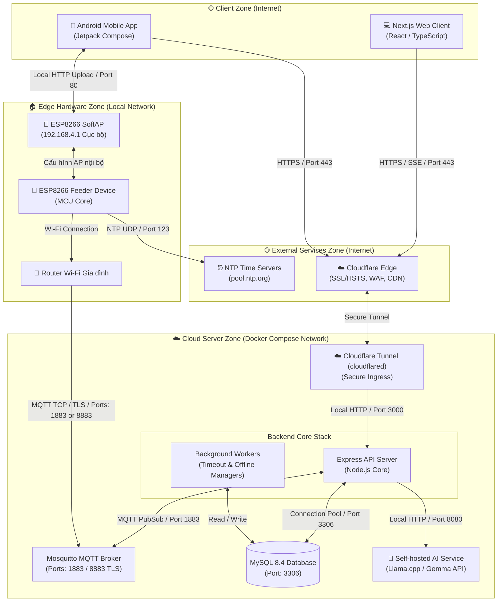

# Hệ sinh thái PawFeed IoT - Danh sách Repositories

Tài liệu này ánh xạ toàn bộ các kho lưu trữ (repositories) cấu thành nên **Hệ sinh thái PawFeed IoT**. Nhấn vào các đường dẫn bên dưới để chuyển hướng đến từng thành phần tương ứng.

---

# [PawFeed_Server](https://github.com/PhongDayNai/PawFeed_Server)

[](https://nodejs.org/)
[](https://expressjs.com/)
[](https://www.mysql.com/)
[](https://mqtt.org/)

Đây là máy chủ API chính, background workers, công cụ quản lý cơ sở dữ liệu và các bộ xử lý tin nhắn MQTT cho **Hệ sinh thái PawFeed IoT**. Được xây dựng bằng Node.js, Express, MySQL và Mosquitto MQTT, thành phần này đóng vai trò điều phối giao tiếp an toàn giữa các thiết bị phần cứng, ứng dụng khách (client) và dịch vụ AI.

## 🚀 Các chức năng cốt lõi của Backend Server

### 1. Xác thực & Bảo mật nâng cao
- **JWT Access & Refresh Token**: Cơ chế xác thực an toàn với thời gian hết hạn chặt chẽ và tự động xoay vòng token trên client.
- **Phân quyền vai trò (Role-based Auth)**: Phân tách quyền truy cập rõ ràng giữa **Người dùng** (chủ nuôi) và **Quản trị viên** (Admin).
- **Nhật ký kiểm toán (Audit Logs)**: Ghi lại các hoạt động nhạy cảm của Admin (như xoay khóa bảo mật, khai báo thiết bị) hỗ trợ lọc dữ liệu và xuất file CSV.
- **Bảo mật ứng dụng**: Tích hợp các headers Helmet, cấu hình CORS, định danh Request ID, chống tấn công Prototype Pollution và thiết lập Rate Limit thông minh.

### 2. Ghép nối & Sở hữu Thiết bị (Device Pairing)
- **Khai báo thiết bị (Claim Flow)**: Admin tạo thiết bị trên hệ thống với mã định danh tự sinh, mã ghép nối (Pairing Code) ngẫu nhiên và khóa bí mật của máy.
- **Xoay vòng Pairing Code**: Đảm bảo an toàn sở hữu thiết bị. Hỗ trợ tạo chuỗi QR Payload để ghép nối nhanh qua camera điện thoại.
- **Liên kết tài khoản (Ownership Linking)**: Cho phép người dùng liên kết thiết bị vào tài khoản bằng Machine Code và Pairing Code. Ghi nhận lịch sử ghép nối/hủy ghép nối chi tiết.

### 3. Cấu hình Ký số Bảo mật (Config Lifecycle)
- **Chữ ký số HMAC-SHA256**: Sinh file cấu hình (thông số Wi-Fi, múi giờ, lịch ăn) kèm theo chữ ký số được tính từ `device_secret` của riêng từng thiết bị.
- **Cấu hình AP cục bộ (SoftAP)**: Ứng dụng di động tải file cấu hình từ server, kết nối vào Wi-Fi do thiết bị phát ra (`192.168.4.1`) và nạp file lên. Thiết bị ESP8266 sẽ tự tính toán lại chữ ký HMAC bằng khóa lưu trong ROM để xác thực file cấu hình trước khi lưu, ngăn chặn các cấu hình giả mạo hoặc lỗi truyền dẫn.

### 4. Điều khiển từ xa & Sự kiện thời gian thực (MQTT & SSE)
- **Yêu cầu Cho ăn ngay (Feed Now)**: Gửi lệnh tức thời xuống thiết bị qua giao thức MQTT (`feeder/:deviceId/cmd`).
- **Server-Sent Events (SSE)**: Duy trì luồng sự kiện thời gian thực (`/v1/events/stream`) đẩy trạng thái hoạt động, phản hồi lệnh ACK và kết quả bữa ăn lên Web/Mobile App ngay lập tức.
- **Hàng đợi Lệnh Ngoại tuyến**: Tự động đưa lệnh vào hàng đợi khi thiết bị offline và gửi đi ngay khi thiết bị kết nối lại.

### 5. Lập Lịch Ăn & Đo lường Từ xa (Telemetry)
- **Lập lịch ăn tự động**: Hỗ trợ tối đa 20 bữa ăn trong ngày, tự động đồng bộ múi giờ thiết bị và kiểm tra giới hạn thời gian mở van xả hạt (từ 100 mili-giây đến 10 phút).
- **Thu thập Telemetry**: Xử lý các bản tin trạng thái thiết bị gửi lên qua MQTT (sóng Wi-Fi RSSI, bộ nhớ RAM Heap trống, thời gian chạy liên tục Uptime, door state).
- **Lịch sử ăn uống**: Ghi nhận toàn bộ kết quả bữa ăn (hoàn thành, thất bại, do lịch trình, nút bấm vật lý hay điều khiển từ xa) vào cơ sở dữ liệu.

### 6. Trợ lý ảo AI Assistant (Nomi Chatbot)
- **Tích hợp LLM Cục bộ**: Kết nối với máy chủ `llama.cpp` chạy mô hình Gemma-4 tương thích chuẩn API OpenAI.
- **System Prompt Động**: Tự động truy vấn và chèn **Bộ nhớ dài hạn** của người dùng (tên pet, cân nặng, loại hạt) và **Cẩm nang Wiki** (hướng dẫn vận hành máy) vào ngữ cảnh hội thoại.
- **Gọi hàm nghiệp vụ (Function Calling Loop)**: Nomi có thể tự gọi các hàm chẩn đoán máy, lấy lịch sử ăn, tính toán lượng calo cần thiết và đề xuất hành động thực tế (như hỏi người dùng duyệt lệnh cho ăn hoặc sửa đổi lịch ăn trên màn hình UI).

### 7. Background Workers (Tiến trình chạy nền)
- **Command Timeout Worker**: Quét định kỳ để hủy/gán lỗi timeout cho các lệnh bị treo không nhận được phản hồi ACK từ thiết bị.
- **Device Offline Worker**: Phát hiện các thiết bị mất kết nối telemetry quá 60 giây để cập nhật trạng thái offline trong DB.

## 🛠️ Công nghệ Sử dụng

- **Runtime**: Node.js v20+ (ES Modules)
- **Web Framework**: Express v4.21.2
- **Cơ sở dữ liệu**: MySQL 8.4 (kết nối qua pooling `mysql2/promise`)
- **IoT Message Broker**: Mosquitto MQTT Broker (thư viện `mqtt` v5.10.3)
- **AI Server**: `llama.cpp` (OpenAI Compatible API)
- **Xác thực dữ liệu**: Zod v3.24.1
- **Mã hóa & Bảo mật**: bcryptjs, jsonwebtoken, helmet, express-rate-limit

## 📂 Cấu trúc Thư mục

```text
PawFeed_Server/
├── Dockerfile
├── deploy/                 # File cấu hình triển khai Docker Compose & Nginx
├── docker-compose.yml      # Cấu hình container chạy local (Server + DB)
├── docs/                   # Tài liệu đặc tả hệ thống, sơ đồ và API chi tiết
├── package.json
├── scripts/                # Script tiện ích (migration, seed, scan bảo mật)
├── sql/
│   ├── migrations/         # Mã SQL khởi tạo và cập nhật cấu trúc database
│   └── seeds/              # Dữ liệu mẫu dùng để test phát triển
└── src/
    ├── app.js              # Khởi tạo Express app và đăng ký middleware bảo mật
    ├── server.js           # Khởi chạy server HTTP và kết nối MQTT client
    ├── cli/                # Các câu lệnh terminal nội bộ
    ├── config/             # Cấu hình biến môi trường, JWT, database
    ├── controllers/        # Tiếp nhận HTTP request và xử lý luồng nghiệp vụ
    ├── middleware/         # Xác thực JWT, Rate limiting, chặn pollution payload
    ├── mqtt/               # MQTT connection service và các bộ xử lý message
    ├── routes/             # Khai báo các endpoints API RESTful
    ├── services/           # Truy vấn DB, xử lý logic chatbot AI và logic cốt lõi
    ├── utils/              # Tiện ích mã hóa, định dạng phản hồi JSON
    ├── validators/         # Zod schemas kiểm tra dữ liệu đầu vào
    └── workers/            # Tiến trình kiểm tra timeout lệnh và thiết bị offline
```

## 🔌 Kiến trúc Hệ thống & Luồng Dữ liệu

Dưới đây là mô hình kiến trúc hạ tầng và giao tiếp của toàn bộ hệ sinh thái PawFeed:



## ⚡ Cài đặt & Chạy Thử cục bộ

### 1. Yêu cầu Hệ thống
Đảm bảo máy tính của bạn đã cài đặt các công cụ sau:
- **Node.js** (phiên bản >= 20.0.0)
- **MySQL** 8.4 hoặc Docker

### 2. Thiết lập Ban đầu
Tải mã nguồn về máy, di chuyển vào thư mục dự án và cài đặt dependencies:
```bash
npm install
```

Tạo file môi trường cấu hình cục bộ từ file mẫu:
```bash
cp .env.example .env
```
Mở file `.env` vừa tạo và chỉnh sửa thông số kết nối MySQL, JWT Secret, và thông tin MQTT Broker của bạn.

### 3. Cập nhật Cơ sở Dữ liệu & Dữ liệu mẫu
Đảm bảo MySQL đang chạy, sau đó thực thi các lệnh sau:
```bash
# Kiểm tra trạng thái migrations hiện tại
npm run db:status

# Chạy migrations để tự động dựng các bảng dữ liệu
npm run db:migrate

# Nạp dữ liệu mẫu (Tạo Admin mặc định, máy chủ MQTT và thiết bị thử nghiệm feeder001)
npm run db:seed
```

#### Thông tin Tài khoản Mẫu sau khi Seed
- **Tài khoản Admin**:
  - Email: `admin@example.com`
  - Mật khẩu: `Admin@123456`
- **Thông tin Thiết bị Mẫu**:
  - `deviceId`: `feeder001`
  - `machineCode`: `PF-ESP8266-001`
  - `pairingCode`: `A8K2-91PQ`
  - `deviceSecret`: `CHANGE_ME_DEVICE_SECRET`
  - `mqttUsername`: `feeder001`
  - `mqttPassword`: `feeder001_dev_password`

### 4. Khởi chạy Server
Chạy ứng dụng Express API và các background workers ở chế độ phát triển (development):
```bash
npm run dev
```

Chạy ở chế độ production:
```bash
npm start
```
Mặc định, server sẽ lắng nghe tại cổng `http://localhost:3000`.

### 5. Chạy Kiểm tra Chất lượng Code
Dự án tích hợp các script kiểm tra chất lượng nguồn và quét an toàn:
```bash
# Kiểm tra cú pháp JavaScript
npm run check

# Kiểm tra sức khỏe của server đang chạy
npm run health

# Kiểm tra tính tuân thủ đặc tả API
npm run spec:check

# Quét phát hiện rò rỉ khóa bí mật / thông tin nhạy cảm
npm run security:scan
```

## 🐳 Triển khai nhanh bằng Docker Compose

Nếu bạn muốn khởi chạy toàn bộ stack backend bao gồm API server và container MySQL một cách tự động:

1. Dựng và chạy các containers:
   ```bash
   docker compose up -d --build
   ```
2. Chạy migration tạo bảng dữ liệu bên trong container:
   ```bash
   docker compose exec server npm run db:migrate
   ```
3. (Tùy chọn) Nạp dữ liệu seed thử nghiệm:
   ```bash
   docker compose exec server npm run db:seed
   ```
4. Kiểm tra sức khỏe API:
   ```bash
   curl http://localhost:3000/v1/health
   ```
5. Tắt và dọn dẹp hệ thống:
   ```bash
   docker compose down
   # Để xóa sạch cả ổ đĩa dữ liệu MySQL đi kèm:
   docker compose down -v
   ```

## 🤖 Cơ chế Trợ lý ảo AI Nomi & Function Calling

Nomi tích hợp LLM và được tối ưu hóa ngữ cảnh thông qua cơ chế tự động tiêm thông tin:
1. **Internal Tools** (Các công cụ chạy ngầm như `calculateDailyFoodRequirement`, `updateUserMemory`, `getUserDeviceDetail`): Server tự chạy ngầm và trả kết quả tính toán hoặc truy vấn về cho LLM mà không hiển thị ra giao diện.
2. **Interactive Tools** (Các công cụ tương tác như `proposeFeedNow`, `proposeSaveSchedule`): Khi AI muốn thực hiện các hành động vật lý này, server dừng vòng lặp hội thoại và trả thẳng cấu trúc `tool_calls` về client.
3. Ứng dụng khách (Mobile App / Web) sẽ bắt sự kiện này để vẽ một **Thẻ xác nhận hành động** lên màn hình UI (ví dụ: *"Bạn có đồng ý cho Milo ăn 20g hạt ngay lập tức?"*). Lệnh vật lý chỉ thực sự được gửi đi khi người dùng nhấn nút phê duyệt trên giao diện.

## 📜 Danh sách API tóm tắt

Tài liệu đặc tả toàn bộ các endpoints nằm ở [api-endpoints.md](file:///home/dhpho/workspace/PawFeed/src/pet-feeder-server/docs/api-endpoints.md). Một số API chính:

| Endpoint | Method | Role | Mô tả |
| :--- | :---: | :---: | :--- |
| `/v1/health` | `GET` | Public | Kiểm tra sức khỏe và phiên bản dịch vụ |
| `/v1/auth/register` | `POST` | Public | Đăng ký tài khoản người dùng mới |
| `/v1/auth/login` | `POST` | Public | Đăng nhập, nhận Access/Refresh JWT |
| `/v1/auth/refresh` | `POST` | Public | Lấy Access Token mới bằng Refresh Token |
| `/v1/devices` | `GET` | User | Liệt kê danh sách máy ăn đã liên kết của user |
| `/v1/devices/link` | `POST` | User | Liên kết máy mới vào tài khoản |
| `/v1/devices/:deviceId/commands/feed-now` | `POST` | User | Gửi lệnh MQTT yêu cầu cho ăn ngay |
| `/v1/devices/:deviceId/config-file` | `POST` | User | Tính toán và xuất file cấu hình ký số HMAC |
| `/v1/events/stream` | `GET` | User | Thiết lập luồng sự kiện thời gian thực SSE |
| `/v1/chatbot/init` | `POST` | User | Khởi tạo phiên trò chuyện chatbot |
| `/v1/chatbot` | `POST` | User | Gửi câu hỏi, nhận phản hồi stream/tool call |
| `/v1/admin/devices` | `POST` | Admin | Khai báo/Tạo thông tin máy vật lý mới |
| `/v1/admin/audit-logs` | `GET` | Admin | Lọc nhật ký kiểm toán hệ thống (hỗ trợ xuất CSV) |

---

# [PawFeed_Web](https://github.com/PhongDayNai/PawFeed_Web)

Kho lưu trữ ứng dụng Web client dành cho hệ thống PawFeed IoT.

- **Đường dẫn Repository**: [https://github.com/PhongDayNai/PawFeed_Web](https://github.com/PhongDayNai/PawFeed_Web)
- **Trạng thái**: Vui lòng truy cập repository Web để xem mã nguồn, hướng dẫn cài đặt và mô tả chi tiết chức năng.

---

# [PawFeed_App](https://github.com/PhongDayNai/PawFeed_App)

Kho lưu trữ ứng dụng di động Mobile app dành cho hệ thống PawFeed IoT.

- **Đường dẫn Repository**: [https://github.com/PhongDayNai/PawFeed_App](https://github.com/PhongDayNai/PawFeed_App)
- **Trạng thái**: Vui lòng truy cập repository App để xem mã nguồn, hướng dẫn cài đặt và mô tả chi tiết chức năng.

---

# [PawFeed_Firmware (main.cpp)](https://github.com/PhongDayNai/PawFeed_Server/blob/main/machine/main.cpp)

Mã nguồn firmware chạy trên vi điều khiển ESP8266 (viết bằng C++/Arduino).

- **Đường dẫn File**: [https://github.com/PhongDayNai/PawFeed_Server/blob/main/machine/main.cpp](https://github.com/PhongDayNai/PawFeed_Server/blob/main/machine/main.cpp)
- **Chi tiết**: Firmware này được lưu giữ ngay trong repository Server dưới thư mục `machine/`. Lớp mã nguồn này chạy trực tiếp trên phần cứng máy cho ăn ESP8266, điều khiển động cơ quay để xả hạt, cấu hình mạng SoftAP, giao tiếp MQTT, đồng bộ thời gian NTP và chạy lịch trình cho ăn offline độc lập.
