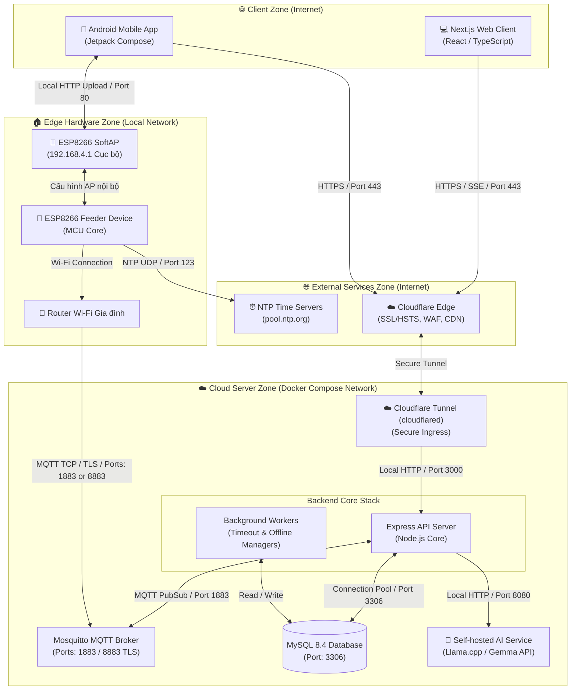

# PawFeed IoT Ecosystem - Repositories

This document maps all the repositories that form the **PawFeed IoT Ecosystem**. Click on the links below to navigate to each component.

---

# [PawFeed_Server](https://github.com/PhongDayNai/PawFeed_Server)

[](https://nodejs.org/)
[](https://expressjs.com/)
[](https://www.mysql.com/)
[](https://mqtt.org/)

The core backend API server, background workers, database management tools, and MQTT handlers for the **PawFeed IoT Ecosystem**. Built with Node.js, Express, MySQL, and Mosquitto MQTT, it orchestrates secure communication between hardware devices, user clients, and AI services.

## 🚀 Key Features of Backend Server

### 1. Authentication & Security Hardening
- **Access & Refresh JWT Tokens**: Secure authentication with strict expiration rules and token rotation on the mobile client.
- **Role-Based Authorization**: Distinct access levels for standard **Users** (pet owners) and **Admins**.
- **Audit Logs**: Transparently records sensitive operations (e.g. key rotations, device provisioning) with actor role tracking, metadata JSON, and CSV export.
- **Request Protection**: Integrated Helmet headers, CORS filters, request ID propagation, prototype pollution guard, and custom rate-limit rules.

### 2. Device Provisioning & Pairing
- **Admin Claim Flow**: Devices are initialized in the DB with automatic unique IDs, random pairing codes, and cryptographic secrets.
- **Pairing-Code Rotation**: Secures device ownership claims. QR payload generation is supported for easy mobile onboarding.
- **Ownership Linking**: Safely binds hardware to user accounts. Prevents duplicate linking and tracks registration history.

### 3. Secure Cryptographic Configs (Config Lifecycle)
- **HMAC-SHA256 Signatures**: Generates signed JSON configurations (Wi-Fi details, timezone, schedule structure) using the device's unique `device_secret`.
- **Local SoftAP Provisioning**: The mobile app downloads the signed config file from the server, connects to the device's local Access Point (`192.168.4.1`), and uploads it. The ESP8266 verifies the HMAC signature using its on-chip secret before applying the configuration, shielding the hardware from tampered firmware inputs.

### 4. Remote Feeding Controls (MQTT & SSE)
- **Remote "Feed Now" Command**: Sends instantaneous feed orders through MQTT (`feeder/:deviceId/cmd`).
- **SSE Stream**: Keeps clients updated in real time. Changes in device state, command acknowledgment, and feeding statuses are broadcasted via Server-Sent Events (`/v1/events/stream`).
- **Offline Queueing**: If a device is offline, commands are queued and flushed immediately upon reconnection.

### 5. Automated Feeding Schedules & Telemetry
- **Daily Schedule Manager**: Supports up to 20 meals, strict timezone-offset conversions, and open-duration limits (100ms - 10mins).
- **Telemetry Processing**: Parses real-time diagnostic reports (Wi-Fi RSSI, Heap size, Uptime, Internal epoch, door state).
- **Feeding Histories**: Tracks complete feeding outcomes (completed, failed, manual, scheduled) in the DB.

### 6. Nomi AI Assistant (Chatbot & Function Calling)
- **Local AI Service Integration**: Communicates with a self-hosted `llama.cpp` server running the Gemma-4 model.
- **Dynamic System Prompt**: Automatically injects long-term **User Memory** (pet names, breed, weight, food specs) and **Wiki Context** (product specifications) into the AI payload.
- **Function Calling Loop**: Nomi can query device statuses, fetch feeding history, compute recommended food weights, and propose physical actions (e.g. suggesting a feed-now order or a schedule update), which the client presents as approval prompts.

### 7. Background Workers
- **Command Timeout Worker**: Periodically checks and timeouts commands that lack hardware ACK or execution events.
- **Device Offline Worker**: Detects stale devices that have missed telemetry heartbeats for over 60s, marking them offline.

## 🛠️ Technology Stack

- **Runtime**: Node.js v20+ (ES Modules)
- **API Framework**: Express v4.21.2
- **Database**: MySQL 8.4 (using `mysql2/promise` connection pooling)
- **IoT Message Broker**: Mosquitto MQTT Broker (via `mqtt` v5.10.3)
- **LLM Engine**: Self-hosted `llama.cpp` (OpenAI Compatible API)
- **Input Validation**: Zod v3.24.1
- **Security Utilities**: bcryptjs, jsonwebtoken, helmet, express-rate-limit

## 📂 Project Structure

```text
PawFeed_Server/
├── Dockerfile
├── deploy/                 # Docker Compose deployment & server configs
├── docker-compose.yml      # Multi-container local orchestration
├── docs/                   # Full system, use-case, and API specifications
├── package.json
├── scripts/                # Utility scripts (health, db migrate/seed, scan)
├── sql/
│   ├── migrations/         # SQL files for database schema versioning
│   └── seeds/              # Seed data for local testing
└── src/
    ├── app.js              # Express app initialization & middleware configuration
    ├── server.js           # Server startup (HTTP port bind & MQTT client boot)
    ├── cli/                # Terminal tooling
    ├── config/             # Environment, DB, JWT, and worker parameters
    ├── controllers/        # Request handling and controller business logic
    ├── middleware/         # Auth, Rate limiting, Security guards, Error handling
    ├── mqtt/               # MQTT connection service, routers, and handlers
    ├── routes/             # RESTful API route registers
    ├── services/           # DB queries, AI prompt builder, and core logic
    ├── utils/              # Cryptography, response helpers, and validation
    ├── validators/         # Input schemas (Zod)
    └── workers/            # Stale device monitor and command timeout worker
```

## 🔌 System Architecture & Data Flow

Below is the deployment and network architecture of the entire ecosystem:



## ⚡ Setup & Local Development

### 1. Requirements
Ensure you have the following installed locally:
- **Node.js** (version >= 20.0.0)
- **MySQL** 8.4 or Docker

### 2. Initial Setup
Clone the repository, enter the directory, and install dependencies:
```bash
npm install
```

Create your local environment file:
```bash
cp .env.example .env
```
Open `.env` and configure your database settings, JWT secrets, and MQTT broker details.

### 3. Database Migration & Seeding
Configure your MySQL database, then run the utility scripts:
```bash
# Check current migration status
npm run db:status

# Run all migrations to build the tables
npm run db:migrate

# Seed dummy data (default Admin, local-broker, and feeder001 device)
npm run db:seed
```

#### Default Seed Credentials
- **Admin Login**:
  - Email: `admin@example.com`
  - Password: `Admin@123456`
- **Seeded Hardware Device**:
  - `deviceId`: `feeder001`
  - `machineCode`: `PF-ESP8266-001`
  - `pairingCode`: `A8K2-91PQ`
  - `deviceSecret`: `CHANGE_ME_DEVICE_SECRET`
  - `mqttUsername`: `feeder001`
  - `mqttPassword`: `feeder001_dev_password`

### 4. Running the Server
Run the Express API server and background processes in development mode:
```bash
npm run dev
```

For production deployment:
```bash
npm start
```
The server binds to `http://localhost:3000` by default.

### 5. Running Code Verification
Ensure the codebase adheres to standard rules and runs securely:
```bash
# Verify syntax correctness
npm run check

# Check API health status
npm run health

# Validate API specifications
npm run spec:check

# Scan database and config files for secrets leaks
npm run security:scan
```

## 🐳 Docker Compose Deployment

If you want to run the whole server stack (API server and MySQL container) using Docker Compose:

1. Build and run containers:
   ```bash
   docker compose up -d --build
   ```
2. Run database setup inside the container:
   ```bash
   docker compose exec server npm run db:migrate
   ```
3. (Optional) Run seeding:
   ```bash
   docker compose exec server npm run db:seed
   ```
4. Verify server health:
   ```bash
   curl http://localhost:3000/v1/health
   ```
5. Tear down containers:
   ```bash
   docker compose down
   # To clean up persistent MySQL volumes as well:
   docker compose down -v
   ```

## 🤖 Nomi AI Assistant & Function Calling Details

Nomi runs on a local LLM, utilizing a dynamic system context containing pet details stored in MySQL (`chatbot_user_memories`) and technical documents stored in `chatbot_wiki`.

The chatbot server parses responses. When the LLM requests a tool execution, the server processes it:
1. **Internal Tools** (e.g. `calculateDailyFoodRequirement`, `updateUserMemory`, `getUserDeviceDetail`) execute silenty on the server and return calculations or queries to the LLM.
2. **Interactive Tools** (e.g. `proposeFeedNow`, `proposeSaveSchedule`) pause the AI loop. The API returns the raw `tool_calls` back to the user client.
3. The mobile/web frontend intercepts this, draws a **confirmation card** (e.g. *"Would you like to feed Milo 20g now?"*), and executes the physical API once the user clicks "Approve".

## 📜 API Catalog Summary

Detailed documentation is available in [api-endpoints.md](file:///home/dhpho/workspace/PawFeed/src/pet-feeder-server/docs/api-endpoints.md). Key routing endpoints:

| Endpoint | Method | Role | Description |
| :--- | :---: | :---: | :--- |
| `/v1/health` | `GET` | Public | Returns service runtime health state |
| `/v1/auth/register` | `POST` | Public | Registers a new user account |
| `/v1/auth/login` | `POST` | Public | Auths user, returns Access/Refresh JWTs |
| `/v1/auth/refresh` | `POST` | Public | Obtains a new Access Token |
| `/v1/devices` | `GET` | User | Lists linked devices owned by the user |
| `/v1/devices/link` | `POST` | User | Links a device using pairing code & machine code |
| `/v1/devices/:deviceId/commands/feed-now` | `POST` | User | Dispatches an MQTT remote feed now command |
| `/v1/devices/:deviceId/config-file` | `POST` | User | Computes and returns signed config files |
| `/v1/events/stream` | `GET` | User | Establishes SSE stream connection |
| `/v1/chatbot/init` | `POST` | User | Initializes chatbot session |
| `/v1/chatbot` | `POST` | User | Sends queries, returns AI streaming / tool calls |
| `/v1/admin/devices` | `POST` | Admin | Provisions a new physical device in the system |
| `/v1/admin/audit-logs` | `GET` | Admin | Fetches system audit logs (CSV export supported) |

---

# [PawFeed_Web](https://github.com/PhongDayNai/PawFeed_Web)

The Next.js web application client dashboard for the PawFeed IoT system.

- **Repository Link**: [https://github.com/PhongDayNai/PawFeed_Web](https://github.com/PhongDayNai/PawFeed_Web)
- **Details**: Refer to the Web repository for source code, setup instructions, and frontend features.

---

# [PawFeed_App](https://github.com/PhongDayNai/PawFeed_App)

The Jetpack Compose Android mobile client application for the PawFeed IoT system.

- **Repository Link**: [https://github.com/PhongDayNai/PawFeed_App](https://github.com/PhongDayNai/PawFeed_App)
- **Details**: Refer to the Mobile App repository for source code, setup instructions, and mobile features.

---

# [PawFeed_Firmware (main.cpp)](https://github.com/PhongDayNai/PawFeed_Server/blob/main/machine/main.cpp)

The ESP8266 microcontroller firmware codebase (written in C++/Arduino).

- **File Link**: [https://github.com/PhongDayNai/PawFeed_Server/blob/main/machine/main.cpp](https://github.com/PhongDayNai/PawFeed_Server/blob/main/machine/main.cpp)
- **Details**: This firmware is kept in this repository under the `machine/` folder. It runs directly on the ESP8266 hardware, handling motor control for food dispensing, local SoftAP Wi-Fi provisioning, MQTT messaging, NTP time synchronization, and offline feeding schedules.
